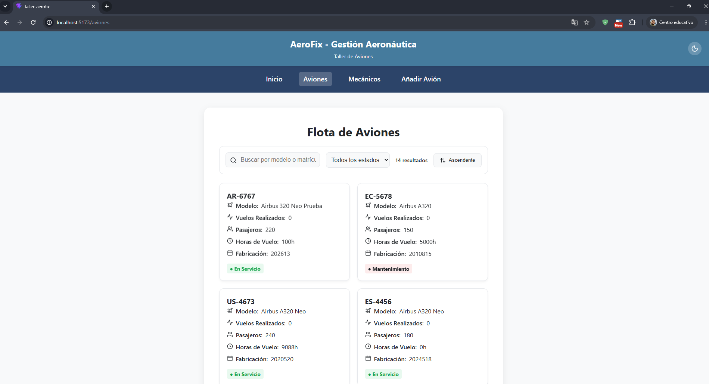
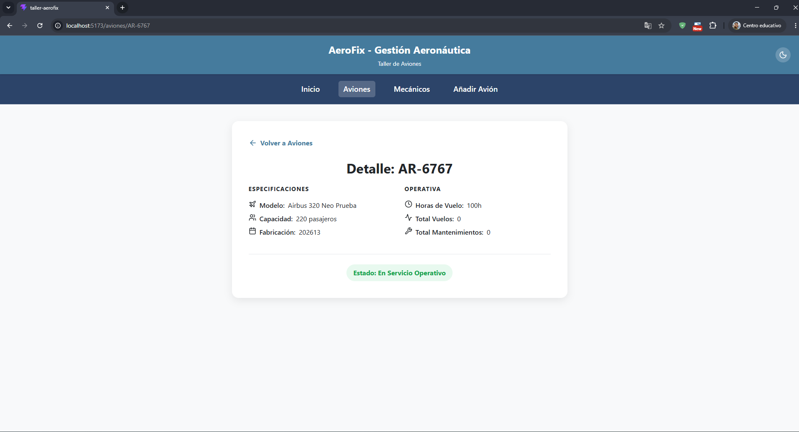

# AeroFix - Sistema de Gestión de Mantenimiento Aeronáutico


AeroFix es una aplicación web profesional diseñada para optimizar las operaciones de mantenimiento en hangares y talleres aeronáuticos. Proporciona un panel centralizado para la monitorización de la flota, gestión del personal técnico y registro de nuevas aeronaves con alta precisión y retroalimentación en tiempo real.

## Características Principales

- **Monitorización de Flota:** Acceso en tiempo real al estado de los aviones, horas de vuelo e historial operativo.
- **Directorio de Personal Técnico:** Gestión de mecánicos especializados, su disponibilidad y niveles de experiencia.
- **Búsqueda y Análisis Dinámico:** Sistema avanzado de filtrado y ordenación para gestionar grandes conjuntos de datos sin recargas de página.
- **Interfaz Adaptativa:** Diseño responsivo con selector de modo claro/oscuro y persistencia de preferencias de usuario.
- **Entrada de Datos Robusta:** Protocolos de validación estrictos para el registro de nuevas unidades, asegurando la integridad de los datos.

## Arquitectura Técnica

### Frontend
Desarrollado con **React 19** y **TypeScript**, utilizando una arquitectura de componentes modulares para máxima reutilización y mantenibilidad. Los estilos se gestionan mediante **CSS Vanilla** con un sistema de diseño basado en variables.

### Integración con el Backend (API AeroFix)
La aplicación consume una API REST desarrollada en **Spring Boot**. Las integraciones clave incluyen:

| Endpoint | Método | Descripción |
|----------|--------|-------------|
| `/api/aviones` | `GET` | Recupera el listado completo de la flota de aviones. |
| `/api/aviones/{id}` | `GET` | Obtiene especificaciones técnicas detalladas de un avión específico. |
| `/api/aviones` | `POST` | Registra una nueva unidad con validación en el servidor. |
| `/api/mecanicos` | `GET` | Lista todo el personal técnico y su estado de disponibilidad actual. |

## Principios de Diseño (Leyes de Gestalt)

La interfaz ha sido diseñada siguiendo estándares de UI/UX, aplicando específicamente las leyes de Gestalt para mejorar la claridad cognitiva.

### 1. Ley de Similitud
Utilizamos patrones visuales uniformes para los contenedores de datos. Cada tarjeta de avión o mecánico comparte propiedades estructurales idénticas (sombras, bordes, estados hover), permitiendo al usuario categorizar elementos instantáneamente por su naturaleza visual.


### 2. Ley de Proximidad
La información se agrupa espacialmente para crear relaciones semánticas lógicas. Las etiquetas, iconos y valores se sitúan próximos entre sí para formar una única "unidad informativa", reduciendo el movimiento ocular y la carga cognitiva.


## Instalación y Configuración

### Requisitos Previos
- Node.js (v18+)
- API AeroFix (Spring Boot) ejecutándose en `http://localhost:8080`

### Pasos
1. **Clonar el repositorio:**
   ```bash
   git clone <url-del-repositorio>
   cd taller-aerofix
   ```

2. **Instalar dependencias:**
   ```bash
   npm install
   ```

3. **Iniciar el servidor de desarrollo:**
   ```bash
   npm run dev
   ```
   La aplicación estará disponible en la URL proporcionada por Vite (habitualmente `http://localhost:5173`).
